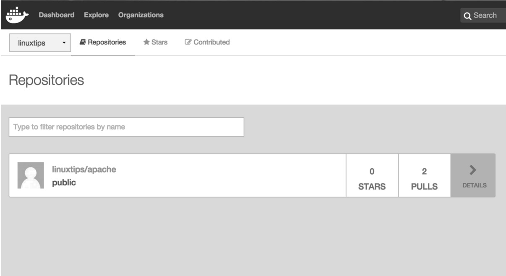

# 9. Compartilhando as imagens

Bem, já aprendemos como criar uma imagem de *container*, seja via
*dockerfile* ou através da modificação de um *container*, e conhecemos
alguns comandos interessantes, como o "docker build" e o "docker
commit".

Agora vamos aprender a compartilhar essas imagens, seja em um *registry*
local ou então no *registry* do próprio Docker Hub.

## 9.1. O que é o Docker Hub?

Docker Hub é um repositório público e privado de imagens que
disponibiliza diversos recursos, como, por exemplo, sistema de
autenticação, *build* automático de imagens, gerenciamento de usuários e
departamentos de sua organização, entre outras funcionalidades.

Pessoas e empresas se juntam, criam seus *containers* seguindo as
melhores práticas, testam tudo direitinho e depois disponibilizam lá
para você usar sem ter nenhum trabalho. Isso é uma mão na roda
gigantesca, uma vez que você não vai ter que perder tempo instalando
coisas. Você também pode usá-lo para aprender como configurar
determinado serviço. Para isso, basta ir no Docker Hub e procurar;
provavelmente alguém já criou um *container* que você poderá usar pelo
menos de base!

Apesar dessa facilidade de encontrar coisas prontas, provavelmente você
não vai querer baixar da internet, mesmo que do *registry* do próprio
Docker (sério), e subir no seu ambiente de produção algo que você não
tem certeza de como funciona, o que é, etc.

Para resolver esse problema o Docker disponibiliza algumas
funcionalidades, como o comando "docker image inspect", que já vimos
antes, quando falávamos de volumes, lembra? Naquele momento usamos a
*flag* "-f" e especificamos um campo de pesquisa, pois o intuito era
mostrar somente a parte que estava sendo discutida naquele capítulo. Mas
o "docker image inspect" vai muito além disso; sem passar o "-f" ele vai
retornar todas as informações contidas naquela imagem, desde a imagem
base que foi utilizada até pontos de montagem, configurações, enfim,
muita coisa. Teste aí:

```bash
root@linuxtips:~# docker image inspect debian
[
    {
        "Id": "sha256:f50f9524513f5356d952965dc97c7e831b02bb6ea0619da9bfc1997e4b9781b7",
        "RepoTags": [
            "debian:8",
            "debian:latest"
        ],
        "RepoDigests": [],
        "Parent": "",
        "Comment": "",
        "Created": "2016-03-01T18:51:14.143360029Z",
        "Container": "557177343b434b6797c19805d49c37728a4445d2610a6647c27055fbe4ec3451",
        "ContainerConfig": {
            "Hostname": "e5c68db50333",
            "Domainname": "",
            "User": "",
            "AttachStdin": false,
            "AttachStdout": false,
            "AttachStderr": false,
            "Tty": false,
            "OpenStdin": false,
            "StdinOnce": false,
            "Env": null,
            "Cmd": [
                "/bin/sh",
                "-c",
                "#(nop) CMD ["/bin/bash"]"
            ],
            "Image": "d8bd0657b25f17eef81a3d52b53da5bda4de0cf5cca3dcafec277634ae4b38fb",
            "Volumes": null,
            "WorkingDir": "",
            "Entrypoint": null,
            "OnBuild": null,
            "Labels": {}
        },
        "DockerVersion": "1.9.1",
        "Author": "",
        "Config": {
            "Hostname": "e5c68db50333",
            "Domainname": "",
            "User": "",
            "AttachStdin": false,
            "AttachStdout": false,
            "AttachStderr": false,
            "Tty": false,
            "OpenStdin": false,
            "StdinOnce": false,
            "Env": null,
            "Cmd": [
                "/bin/bash"
            ],
            "Image": "d8bd0657b25f17eef81a3d52b53da5bda4de0cf5cca3dcafec277634ae4b38fb",
            "Volumes": null,
            "WorkingDir": "",
            "Entrypoint": null,
            "OnBuild": null,
            "Labels": {}
        },
        "Architecture": "amd64",
        "Os": "linux",
        "Size": 125110803,
        "VirtualSize": 125110803,
        "GraphDriver": {
            "Name": "aufs",
            "Data": null
        }
    }
]

root@linuxtips:~#
```

Às vezes será disponibilizado junto com a imagem o seu respectivo
*dockerfile* e aí fica bem mais fácil: basta ler esse arquivo para saber
exatamente como ela foi criada. :)

Um comando bastante interessante, que nos faz entender como uma imagem é
dividida em camadas (e, principalmente, o que foi feito em cada camada),
é o "docker history".

```bash
root@linuxtips:~# docker history linuxtips/apache:1.0

IMAGE        CREATED        CREATED BY                                      SIZE         COMMENT
4862def18dfd 36 minutes ago /bin/sh -c #(nop) EXPOSE 80/tcp                 0 B
06210ac863da 36 minutes ago /bin/sh -c #(nop) VOLUME [/var/www/html/]       0 B
fed9b6bc7ad9 36 minutes ago /bin/sh -c #(nop) LABEL description=Webserver   0 B
68f6e8de3df3 36 minutes ago /bin/sh -c #(nop) ENV APACHE_LOG_DIR=/var/log   0 B
1a129e753d1e 36 minutes ago /bin/sh -c #(nop) ENV APACHE_RUN_GROUP=www-da   0 B
f0f9d7be7c70 36 minutes ago /bin/sh -c #(nop) ENV APACHE_RUN_USER=www-dat   0 B
3dafea4a403a 36 minutes ago /bin/sh -c #(nop) ENV APACHE_PID_FILE=/var/ru   0 B
f31eb176ecc8 36 minutes ago /bin/sh -c #(nop) ENV APACHE_LOCK_DIR=/var/lo   0 B
0bbefd91da05 36 minutes ago /bin/sh -c apt-get update && apt-get install    68.29 MB
f50f9524513f 12 days ago    /bin/sh -c #(nop) CMD ["/bin/bash"]             0 B
<missing>    12 days ago    /bin/sh -c #(nop) ADD file:b5393172fb513d       125.1MB

root@linuxtips:~#
```

Perceba que as primeiras linhas da saída do comando anterior são
referentes às informações que pedimos para adicionar à imagem no
*dockerfile*. As demais camadas são originais da imagem que pegamos do
Docker Hub através da instrução "FROM".

Existe também um site chamado "ImageLayers": ele faz exatamente a mesma
coisa que o "docker history", mas você não precisa baixar a imagem -- e,
bom, é *web*. O ImageLayers pode ser acessado em:
[https://imagelayers.io/](https://imagelayers.io/).

O Docker Hub, como já falamos, tem muitos componentes, dentre eles o
responsável pelo repositório de imagens: o *registry*.

É possível utilizar um *registry* local em vez de um na nuvem, como o
Docker Hub ou outros *registries* que são facilmente encontrados na
internet. Falaremos disso com detalhes mais à frente. :P

Para que você possa utilizar o Docker Hub para gerenciar as suas
imagens, é necessário criar uma conta.

## 9.2. Vamos criar uma conta?

Para que consiga realizar a criação da sua conta, é necessário acessar a
URL [https://hub.docker.com](https://hub.docker.com).
Antes era possível através do comando "docker login". Hoje, o comando
"docker login" somente é utilizado para autenticar no Docker Hub após a
criação da conta.

A partir da confirmação do seu e-mail, já é possível se autenticar e
começar a fazer uso do Docker Hub.

```bash
root@linuxtips:~# docker login
Login with your Docker ID to push and pull images from Docker Hub. If you don't have a Docker ID, head over to https://hub.docker.com to create one.

Username: linuxtips01
Password:
Login Succeeded

root@linuxtips:~#
```

Você consegue criar repositórios públicos à vontade, porém na conta
*free* você somente tem direito a um repositório privado. Caso precise
de mais do que um repositório privado, é necessário o *upgrade* da sua
conta e o pagamento de uma mensalidade. :)

Caso você queira especificar outro *registry* em vez do Docker Hub,
basta passar o endereço como parâmetro, como segue:

```bash
# docker login registry.seilaqual.com
```

## 9.3. Agora vamos compartilhar essas imagens na *interwebs*!

Uma vez que já criamos a nossa conta no Docker Hub, podemos começar a
utilizá-la!

Como exemplo, vamos utilizar a imagem que montamos com o *dockerfile* no
capítulo anterior chamada "linuxtips/apache". Quando realizarmos o
*upload* dessa imagem para o Docker Hub, o repositório terá o mesmo nome
da imagem, ou seja, "linuxtips/apache".

Uma coisa muito importante! A sua imagem deverá ter o seguinte padrão,
para que você consiga fazer o *upload* para o Docker Hub:

**seuusuario/nomedaimagem:versão**

Assim, sabemos que "linuxtips/apache:1.0" significa:

-   **linuxtips** -- Usuário do Docker Hub.

-   **apache** -- Nome da imagem.

-   **1.0** -- Versão.

Agora vamos utilizar o comando "docker push", responsável por fazer o
*upload* da imagem da sua máquina local para o *registry* do Docker Hub,
como mostrado no exemplo a seguir:

```bash
root@linuxtips:~# docker push linuxtips/apache:1.0
The push refers to a repository [docker.io/linuxtips/apache]
b3a691489ee1: Pushed
5f70bf18a086: Layer already exists
917c0fc99b35: Pushed
1.0: digest: sha256:c8626093b19a686fd260dbe0c12db79a97ddfb6a6d8e4c4f44634f66991d93d0 size: 6861

root@linuxtips:~#
```

Acessando a URL
[https://hub.docker.com/](https://hub.docker.com/)
você conseguirá visualizar o repositório que acabou de criar, conforme a
imagem a seguir:



Por padrão, ele cria o repositório como público. ;)

Caso você queira visualizar o seu novo repositório pela linha de
comando, basta utilizar o comando "docker search" seguido de seu usuário
do Docker Hub:

```bash
root@linuxtips:~# docker search <seu_usuario>

NAME                DESCRIPTION      STARS            OFFICIAL       AUTOMATED
linuxtips/apache                     0
```

Já que possuímos a imagem no *registry* do Docker Hub, vamos testá-la
fazendo o *pull* da imagem e em seguida vamos executando-a para saber se
realmente tudo isso funciona de forma simples e fácil assim. :)

Primeiro vamos parar os *containers* que utilizam a imagem
"linuxtips/apache":

```bash
# docker container ls | grep seu_usuario/sua_imagem
# docker container stop CONTAINERID
```

Não é possível remover uma imagem se algum *container* estiver em
execução utilizando-a como imagem base. Por isso é necessário parar os
*containers* conforme fizemos antes.

Para que você possa remover uma imagem é necessário utilizar o comando
"docker image rm", responsável por remover imagens do disco local.

É importante mencionar que, caso possua *containers* parados que
utilizam essa imagem como base, é necessário forçar a remoção da imagem
utilizando o parâmetro "-f":

```bash
# docker image rm -f linuxtips/apache:1.0
Untagged: linuxtips/apache:1.0
```

Pronto! Removemos a imagem!

Agora vamos realizar o *pull* da imagem diretamente do *registry* do
Docker Hub para que tenhamos a imagem novamente em nosso disco local e
assim possamos subir um *container* utilizando-a.

```bash
root@linuxtips:~# docker pull linuxtips/apache:1.0
1.0: Pulling from linuxtips/apache
fdd5d7827f33: Already exists
a3ed95caeb02: Already exists
11b590220174: Already exists
Digest: sha256:c8626093b19a686fd260dbe0c12db79a97ddfb6a6d8e4c4f44634f66991d93d0
Status: Downloaded newer image for linuxtips/apache:1.0

root@linuxtips:~#
```

Podemos novamente visualizá-la através do comando "docker image ls".

```bash
root@linuxtips:~# docker image ls
REPOSITORY           TAG  IMAGE ID        CREATED             SIZE
linuxtips/apache     1.0  4862def18dfd    About an hour ago   193.4 MB

root@linuxtips:~#
```

Para criar o *container* utilizando nossa imagem:

```bash
root@linuxtips:~# docker container run -d linuxtips/apache:1.0
```

Simples como voar, não?

## 9.4. Não confio na internet; posso criar o meu *registry* local?

Como muitas empresas não gostam de manter seus dados na nuvem em
serviços de terceiros, existe a possibilidade de você configurar um
*registry* local. Assim, você não precisa utilizar o *registry* do
Docker Hub, por exemplo. Isso permite a você compartilhar suas imagens
com outras pessoas de sua empresa, funcionando como repositório de
imagens Docker. Sensacional!

A URL do projeto fica em
[https://github.com/docker/distribution](https://github.com/docker/distribution).
O Docker Distribution é um *registry* que serve para guardar e
compartilhar suas imagens. Ele substitui o Docker Registry, que se
tornou obsoleto.

Para que possamos ter o Docker Distribution de forma simples e
totalmente funcional, guardando e distribuindo nossas imagens Docker
localmente, basta rodá-lo como um *container*! :D

```bash
root@linuxtips:~# docker container run -d -p 5000:5000 --restart=always --name registry registry:2
Unable to find image 'registry:2' locally
2: Pulling from library/registry
fdd5d7827f33: Already exists
a3ed95caeb02: Pull complete
a79b4a92697e: Pull complete
6cbb75c7cc30: Pull complete
4831699594bc: Pull complete
Digest: sha256:20f5d95004b71fe14dbe7468eff33f18ee7fa52502423c5d107d4fb0abb05c1d
Status: Downloaded newer image for registry:2
4f8efc8a71531656dc74e99dea74da203645c0f342b0706bc74200ae0a50cb20

root@linuxtips:~#
```

Com o comando anterior, criamos um *container* chamado "registry" que
utiliza a imagem "registry:2" como base e usamos a opção
"\--restart=always". Caso ocorra qualquer problema com o *container* ou
com o Docker, ele será iniciado automaticamente. Passamos também que a
porta de comunicação com o *container* será a 5000, que também utilizará
a porta 5000 do *host* com o mesmo propósito. Vamos ver sobre o
parâmetro "-p" em breve, no capítulo relacionado a redes. ;)

Você pode verificar o *container* do *registry* em execução, bem como
sua imagem:

```bash
# docker container ls
# docker image ls
```

Muito bom, nosso *registry* já está em execução! Agora vamos testá-lo
tentando realizar um *push* da nossa imagem para ele.

Primeiramente, teremos que adicionar uma nova *tag* em nossa imagem
mencionando o endereço do novo *registry* em vez do nome do usuário que
utilizávamos quando queríamos fazer o *push* para o Docker Hub. Para
isso, vamos utilizar novamente o comando "docker tag":

```bash
# docker tag IMAGEMID localhost:5000/apache
# docker image ls
```

Agora basta fazer o *push* para o nosso *registry* local da seguinte
forma:

```bash
root@linuxtips:~# docker push localhost:5000/apache
The push refers to a repository [localhost:5000/apache]
b3a691489ee1: Pushed
5f70bf18a086: Pushed
917c0fc99b35: Pushed
latest: digest: sha256:0e69b8d5cea67fcfedb5d7128a9fd77270461aa5852e6fe9b465565ec8e4e12f size: 925

root@linuxtips:~#
```

Pronto! Agora nós possuímos um *registry* local!

Fizemos um *registry* totalmente funcional, porém simples. Caso queira
utilizar recursos como controle de usuários, certificados, outras opções
de *storage*, etc., visite a página do projeto no GitHub:
https://github.com/docker/distribution.
