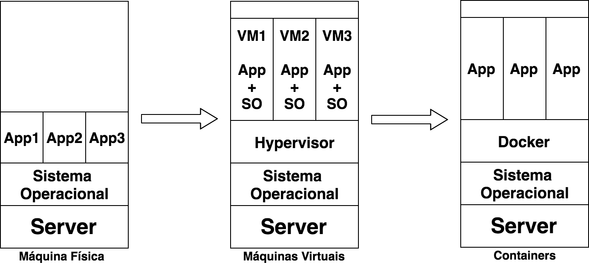

# 1. O que é *container*?

## 1.1. Então vamos lá, o que é um *container*?

*Container* é, em português claro, o agrupamento de uma aplicação junto
com suas dependências, que compartilham o *kernel* do sistema
operacional do *host*, ou seja, da máquina (virtual ou física) onde está
rodando. Deu para entender?

*Containers* são bem similares às máquinas virtuais, porém mais leves e
mais integrados ao sistema operacional da máquina *host*, uma vez que,
como já dissemos, compartilha o seu *kernel*, o que proporciona melhor
desempenho por conta do gerenciamento único dos recursos.

Na maioria dos casos, a imagem de um *container* é bastante enxuta,
havendo somente o necessário para o funcionamento da aplicação, que,
quando em execução, possui um pequeno *overhead* se comparada à mesma
aplicação rodando nativamente no sistema operacional, grande parte disso
por conta do compartilhamento dos recursos com a máquina *host*.

Quando estamos utilizando máquinas virtuais, nós emulamos um novo
sistema operacional e virtualizamos todo o seu hardware utilizando mais
recursos da máquina *host*, o que não ocorre quando utilizamos
*containers*, pois os recursos são compartilhados. O ganho óbvio disso é
a capacidade de rodar mais *containers* em um único *host*, se comparado
com a quantidade que se conseguiria com máquinas virtuais.

A seguir, na figura, podemos notar as diferenças de quando temos
aplicações sendo executadas nativamente, máquinas virtuais e por fim em
*containers*. Repare que não é necessário emular um novo sistema
operacional quando estamos utilizando *containers*, diferentemente das
máquinas virtuais.

Outro ponto interessante na utilização de *containers* é a
portabilidade. Não importa em qual ambiente você criou o seu
*container*, ele irá rodar em qualquer outro que possua, no nosso caso,
o Docker instalado, seja ele no Linux, MacOS ou Windows. Você não
precisa se preocupar com suas dependências, está tudo dentro do
*container*. :D

O desenvolvedor consegue, na sua própria máquina, criar uma aplicação em
*container* e depois executá-la em um servidor de produção sem nenhum
problema de dependência ou algo do tipo -- nem mesmo o bom e velho
"engraçado, na minha máquina funciona" escapa, hein?

Lembre-se: na máquina virtual você emula um novo sistema operacional
dentro do sistema operacional do *host*. Já no *container* você emula
somente as aplicações e suas dependências tornando-o portátil.

## 1.2. E quando começou que eu não vi?

Apesar de o termo ter se tornado *hype* nos últimos anos, durante
décadas já utilizávamos *containers* em sistemas Unix através do comando
*chroot.* Sim, bem mais simplório, é verdade, pois era apenas uma forma
de isolar o *filesystem*, mas já era o começo!

Em seguida vieram os *jails* do FreeBSD, que, além do isolamento do
*filesystem*, permitiam também o isolamento de processos, seguidos de
perto pela Sun, que desenvolveu o *Solaris Zones*, mais uma solução
baseada em *containers*, porém somente para sistemas Solaris.

O grande passo rumo ao cenário que temos hoje foi a criação, pela
Parallels do Virtuozzo, de um painel que permitia o fácil gerenciamento
de *containers* e a disponibilização do *core* do Virtuozzo como *open
source* com o nome de OpenVZ.

O OpenVZ foi uma ferramenta que ganhou bastante destaque no
gerenciamento de *containers* e ajudou e muito na popularização do VPS
(*Virtual Private Server*) e, consequentemente, na criação de centenas
de empresas de *hosting* espalhadas pelo mundo. O principal ponto
negativo do OpenVZ era a necessidade de aplicar um *patch* no *kernel*
Linux.

Logo após surgir o OpenVZ, o Google iniciou o desenvolvimento do CGroups
para o *kernel* do Linux e iniciou a utilização de *containers* em seus
*datacenters*.

Em 2008, desenvolvedores de empresas como Virtuozzo, IBM e o próprio
Google iniciaram o projeto LXC, que trazia consigo o CGroups,
*namespaces* e *chroot* para prover uma completa e estável solução para
a criação e o gerenciamento de *containers*.

Porém, foi no ano de 2013 que os *containers* conquistaram o
*mainstream*, saíram do *underground* através da utilização massiva
pelas empresas de internet e gigantes de tecnologia e invadiram os
principais eventos de tecnologia ao redor do mundo, com palestras sobre
o sucesso na utilização de *containers* e com o melhor aproveitamento
dos recursos físicos como CPU e memória, maior agilidade no *deployment*
de novas aplicações em fração de segundos e tudo isso com uma facilidade
que impressiona. Amigo, estamos falando do simplesmente sensacional
**Docker**.
