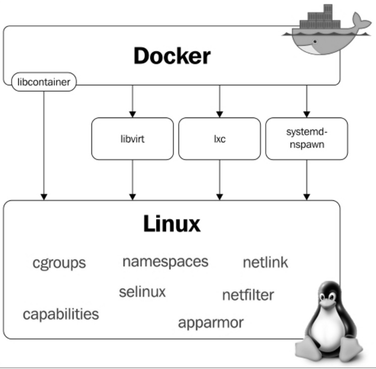

# 2. O que é o Docker?

## 2.1. Onde entra o Docker nessa história?

Tudo começou em 2008, quando Solomon Hykes fundou a dotCloud, empresa
especializada em PaaS com um grande diferencial: o seu
*Platform-as-a-Service* não era atrelado a nenhuma linguagem de
programação específica, como era o caso, por exemplo, da Heroku, que
suportava somente aplicações desenvolvidas em Ruby.

A grande virada na história da dotCloud ocorreu em março de 2013, quando
decidiram tornar *open source* o *core* de sua plataforma -- assim
nascia o Docker!

As primeiras versões do Docker nada mais eram do que um *wrapper* do LXC
integrado ao *Union Filesystem*, mas o seu crescimento foi fantástico e
muito rápido, tanto que em seis meses seu GitHub já possuía mais de seis
mil *stars* e mais de 170 pessoas contribuindo para o projeto ao redor
do mundo.

Com isso, a dotCloud passou a se chamar Docker e a versão 1.0 foi
lançada apenas 15 meses após sua versão 0.1. A versão 1.0 do Docker
trouxe muito mais estabilidade e foi considerada "production ready",
além de trazer o Docker Hub, um repositório público para *containers*.

Por ser um projeto *open source*, qualquer pessoa pode visualizar o
código e contribuir com melhorias para o Docker. Isso traz maior
transparência e faz com que correções de *bugs* e melhorias aconteçam
bem mais rápido do que seria em um software proprietário com uma equipe
bem menor e poucos cenários de testes.

Quando o Docker 1.0 foi lançado e anunciado que estava pronto para
produção, empresas como Spotify já o utilizavam em grande escala; logo
AWS e Google começaram a oferecer suporte a Docker em suas nuvens. Outra
gigante a se movimentar foi a Red Hat, que se tornou uma das principais
parceiras do Docker, inclusive o incorporando-o ao *OpenShift*.

Atualmente, o Docker é oficialmente suportado apenas em máquinas Linux
64 *bits*. Isso significa que seus *containers* também terão que ser um
Linux 64 *bits*, pois lembre que o *container* utiliza o mesmo *kernel*
da máquina *host*. ;)

Hoje o Docker pode ser executado tranquilamente em outras plataformas
como Windows e MacOS, porém ainda não com a mesma performance e
estabilidade do Docker sendo executado no Linux. Ahhh, o Linux! \<3 \<3
\<3

## 2.2. E esse negócio de camadas?

### 2.2.1. *Copy-On-Write* (COW) e Docker

Antes de entender as camadas propriamente ditas, precisamos entender
como um dos principais requisitos para essa coisa acontecer, o
*Copy-On-Write* (ou COW para os íntimos), funciona. Nas palavras do
próprio Jérome Petazzoni:

*It's a little bit like having a book. You can make notes in that book
if you want, but each time you approach the pen to the page, suddenly
someone shows up and takes the page and makes a xerox copy and hand it
back to you, that's exactly how copy on write works.*

Em tradução livre, seria como se você tivesse um livro e que fosse
permitido fazer anotações nele caso quisesse, porém, cada vez que você
estivesse prestes a tocar a página com a caneta, de repente alguém
aparecesse, tirasse uma xerox dessa página e entregasse a cópia para
você. É exatamente assim que o *Copy-On-Write* funciona.

Basicamente, significa que um novo recurso, seja ele um bloco no disco
ou uma área em memória, só é alocado quando for modificado.

Tá, mas o que isso tudo tem a ver com o Docker? Bom, como você sabe, o
Docker usa um esquema de camadas, ou *layers*, e para montar essas
camadas são usadas técnicas de *Copy-On-Write*. Um *container* é
basicamente uma pilha de camadas compostas por N camadas *read-only* e
uma, a superior, *read-write*.

## 2.3. *Storage drivers*

Apesar de um *container* possuir uma camada de escrita, na maior parte
do tempo você não quer escrever dados diretamente nele, por vários
motivos, dentre eles a sua natureza volátil. Em situações onde sua
aplicação gera dados, você vai preferir usar volumes "atachados" ao
*container* e escrever neles (veremos mais à frente como fazer isso).
Porém, em algumas situações é, sim, necessária a escrita local no
*container*, e é aí que o *storage driver* entra na história. *Storage
driver* é o mecanismo utilizado pela *engine* do Docker para ditar a
forma como esses dados serão manipulados no *filesystem* do *container*.
A seguir, os principais *storage drivers* e suas peculiaridades.

### 2.3.1. AUFS (*Another Union File System*)

O primeiro *filesystem* disponível para o Docker foi o AUFS, um dos mais
antigos *Copy-On-Write filesystems*, e inicialmente teve que passar por
algumas modificações a fim de melhorar a estabilidade.

O AUFS funciona no nível de arquivos (não em bloco), e a ideia é ter
múltiplos diretórios (camadas) que ele apresenta para o SO como um ponto
único de montagem.

Quando você tenta ler um arquivo, a busca é iniciada pela camada
superior, até achar o arquivo ou concluir que ele não existe. Para
escrever em um arquivo, este precisa primeiro ser copiado para a camada
superior (*writable*) -- e, sim, você adivinhou: escrever em arquivos
grandes pode causar certa degradação da performance, já que o arquivo
precisaria ser copiado completamente para a primeira camada, mesmo
quando uma parte bem pequena vai sofrer alteração.

Já que estamos falando de coisa chata, outra coisa que pode degradar a
sua performance usando AUFS é o fato de que ele procura cada diretório
de um *path* em cada camada do *filesystem* toda vez que você tentar
executar um comando. Por exemplo, se você tem um *path* com cinco
camadas, serão realizadas 25 buscas (*stat()*, uma *system call*). Isso
pode ser bem complicado em aplicações que fazem *load* dinâmico, como os
*apps* Python que importam os .py da vida.

Outra particularidade é quando algum arquivo é deletado. Quando isso
acontece é criado um *whiteout* para esse arquivo. Em outras palavras,
ele é renomeado para ".wh.arquivo" e fica indisponível para o
*container*, já que, né, não dá para apagar de verdade, pois as outras
camadas são *read-only*.

### 2.3.2. *Device Mapper*

*Device Mapper* é um *kernel-based framework* da Red Hat usado para
algumas abstrações, como, por exemplo, o mapeamento de "blocos físicos"
em "blocos lógicos", permitindo técnicas como LVM e RAID. No contexto do
Docker, porém, ele se resume ao "thin provisioning target" ou ao
*storage driver* "devicemapper". Assim que essa coisa de Docker começou
a andar, o pessoal da Red Hat (e toda a galera que usava alguma *distro*
relacionada com Red Hat) se interessou bastante, só que havia um
problema: eles não queriam usar AUFS. Para resolver isso, eles reuniram
uma equipe de engenheiros muito habilidosos que adicionaram suporte ao
*Device Mapper* no Docker.

Em se tratando de Docker, o *Device Mapper* e o AUFS são bem similares:
a grande diferença entre eles é que, no *Device Mapper*, quando você
precisa escrever no arquivo, a cópia é feita em nível de blocos, que era
um problema lá no AUFS, e com isso você ganha uma granularidade bem
maior. Em teoria, o problema que você tinha quando escrevia um arquivo
grande desaparece. Por padrão, *Device Mapper* escreve em arquivos de
*loopback*, o que deixa as coisas mais lentas, mas agora na versão 1.17+
você já pode configurá-lo em modo *direct-lvm*, que escreve em blocos e,
em teoria, resolveria esse problema. É um pouco mais chatinho de
configurar, mas é uma solução mais elegante para ambientes em produção.

Além de AUFS e *Device Mapper*, você também pode usar BRTFS e OverlayFS
como *storage driver*. Por serem tecnologias relativamente jovens,
aprecie com moderação.

### 2.3.3. OverlayFS e OverlayFS2

A bola da vez. Uma versão melhorada do AUFS, o OverlayFS e sua versão
seguinte e oficialmente recomendada pelo Docker, o Overlay2, são ambos
*other union filesystems*, mas dessa vez muito mais eficientes, rápidos
e com uma implementação muito mais simples.

Por serem *union file systems*, também compartilham da ideia de juntar
vários diretórios em um único ponto de montagem como nosso amigo AUFS,
porém, no caso do OverlayFS, apenas dois diretórios são suportados, o
que não acontece no Overlay2, que tem suporte *multi-layer*. Ambos
suportam *page caching sharing*, ou seja, múltiplos *containers*
acessando o mesmo arquivo dividem a mesma entrada no arquivo de
paginação, o que é um uso mais eficiente de memória.

Aquele problema antigo do AUFS de ter de copiar todo o arquivo para a
camada de cima para escrever nele ainda persiste, porém no OverlayFS ele
só é copiado uma vez e fica lá para que as outras escritas no mesmo
arquivo possam acontecer mais rápido, então tem uma pequena vantagem.

Nota-se um consumo excessivo de *inodes* quando se usa OverlayFS. Esse é
um problema resolvido no Overlay2, então sempre que possível busque
usá-lo -- até porque, no geral, tem uma performance superior. Lembrando
que *kernel* 4.0+ é pré-requisito para usar OverlayFS2.

### 2.3.4. BTRFS

BTRFS é a geração seguinte de *union filesystem*. Ele é muito mais
*space-efficient*, suporta muitas tecnologias avançadas de *storage* e
já está incluso no *mainline* do *kernel*. O BTRFS, diferentemente do
AUFS, realiza operações a nível de bloco e usa um esquema de *thin
provision* parecido com o do *Device Mapper* e suporta *copy-on-write
snapshots*. Você pode inclusive combinar vários *devices* físicos em um
único BTRFS *filesystem*, algo como um LVM.

O BTRFS é suportado atualmente na versão CE apenas em distribuições
*debian-like* e na versão EE apenas em SLES (*Suse Linux Enterprise
Server*).

**IMPORTANTE: alterar o *storage drive* fará com que qualquer
*container* já criado se torne inacessível ao sistema local. Cuidado!**

## 2.4. Docker Internals

O Docker utiliza algumas *features* básicas do *kernel* Linux para seu
funcionamento. A seguir temos um diagrama no qual é possível visualizar
os módulos e *features* do *kernel* de que o Docker faz uso:



## 2.5. *Namespaces*

*Namespaces* foram adicionados no *kernel* Linux na versão 2.6.24 e são
eles que permitem o isolamento de processos quando estamos utilizando o
Docker. São os responsáveis por fazer com que cada *container* possua
seu próprio *environment*, ou seja, cada *container* terá a sua árvore
de processos, pontos de montagens, etc., fazendo com que um *container*
não interfira na execução de outro. Vamos saber um pouco mais sobre
alguns *namespaces* utilizados pelo Docker.

### 2.5.1. PID *namespace*

O PID *namespace* permite que cada *container* tenha seus próprios
identificadores de processos. Isso faz com que o *container* possua um
PID para um processo em execução -- e quando você procurar por esse
processo na máquina *host* o encontrará; porém, com outra identificação,
ou seja, com outro PID.

A seguir temos o processo "testando.sh" sendo executado no *container*.

Perceba o PID desse processo na árvore de processos dele:

```bash
root@c774fa1d6083:/# bash testando.sh &
[1] 7

root@c774fa1d6083:/# ps -ef
UID  PID PPID C STIME TTY TIME     CMD
root 1   0    0 18:06 ?   00:00:00 /bin/bash
root 7   1    0 18:07 ?   00:00:00 bash testando.sh
root 8   7    0 18:07 ?   00:00:00 sleep 60
root 9   1    0 18:07 ?   00:00:00 ps -ef

root@c774fa1d6083:/#
```

Agora, perceba o PID do mesmo processo exibido através do *host*:

```bash
root@linuxtips:~# ps -ef | grep testando.sh

root 2958 2593 0 18:12 pts/2 00:00:00 bash testando.sh
root 2969 2533 0 18:12 pts/0 00:00:00 grep --color=auto testando.sh

root@linuxtips:~#
```

Diferentes, né? Porém, são o mesmo processo. :)

### 2.5.2. Net *namespace*

O *Net Namespace* permite que cada *container* possua sua interface de
rede e portas. Para que seja possível a comunicação entre os
*containers*, é necessário criar dois *Net Namespaces* diferentes, um
responsável pela interface do *container* (normalmente utilizamos o
mesmo nome das interfaces convencionais do Linux, por exemplo, a eth0) e
outro responsável por uma interface do *host*, normalmente chamada de
veth\* (veth + um identificador aleatório). Essas duas interfaces estão
*linkadas* através da *bridge* Docker0 no *host*, que permite a
comunicação entre os *containers* através de roteamento de pacotes.

Conforme falamos, veja as interfaces. Interfaces do *host*:

```bash
root@linuxtips:~# ip addr

1: lo: <LOOPBACK,UP,LOWER_UP> mtu 65536 qdisc noqueue state UNKNOWN group default
       link/loopback 00:00:00:00:00:00 brd 00:00:00:00:00:00
       inet 127.0.0.1/8 scope host lo
           valid_lft forever preferred_lft forever
       inet6 ::1/128 scope host
           valid_lft forever preferred_lft forever
2: eth1: <BROADCAST,MULTICAST,UP,LOWER_UP> mtu 1500 qdisc pfifo_fast state UP group default qlen 1000
        link/ether 00:1c:42:c7:bd:d8 brd ff:ff:ff:ff:ff:ff
        inet 10.211.55.35/24 brd 10.211.55.255 scope global eth1
            valid_lft forever preferred_lft forever
        inet6 fdb2:2c26:f4e4:0:21c:42ff:fec7:bdd8/64 scope global dynamic
            valid_lft 2591419sec preferred_lft 604219sec
        inet6 fe80::21c:42ff:fec7:bdd8/64 scope link
            valid_lft forever preferred_lft forever
3: docker0: <BROADCAST,MULTICAST,UP,LOWER_UP> mtu 1500 qdisc noqueue state UP group default
        link/ether 02:42:c7:c1:37:14 brd ff:ff:ff:ff:ff:ff
        inet 172.17.0.1/16 scope global docker0
            valid_lft forever preferred_lft forever
        inet6 fe80::42:c7ff:fec1:3714/64 scope link
            valid_lft forever preferred_lft forever
5: vetha2e1681: <BROADCAST,MULTICAST,UP,LOWER_UP> mtu 1500 qdisc noqueue master docker0 state UP group default
        link/ether 52:99:bc:ab:62:5e brd ff:ff:ff:ff:ff:ff
        inet6 fe80::5099:bcff:feab:625e/64 scope link
             valid_lft forever preferred_lft forever
root@linuxtips:~#
```

Interfaces do *container*:

```bash
root@6ec75484a5df:/# ip addr

1: lo: <LOOPBACK,UP,LOWER_UP> mtu 65536 qdisc noqueue state UNKNOWN group default
        link/loopback 00:00:00:00:00:00 brd 00:00:00:00:00:00
        inet 127.0.0.1/8 scope host lo
            valid_lft forever preferred_lft forever
        inet6 ::1/128 scope host
            valid_lft forever preferred_lft forever
6: eth0: <BROADCAST,MULTICAST,UP,LOWER_UP> mtu 1500 qdisc noqueue state UP group default
        link/ether 02:42:ac:11:00:03 brd ff:ff:ff:ff:ff:ff
        inet 172.17.0.3/16 scope global eth0
            valid_lft forever preferred_lft forever
        inet6 fe80::42:acff:fe11:3/64 scope link
            valid_lft forever preferred_lft forever

root@6ec75484a5df:/#
```

Conseguiu visualizar as interfaces Docker0 e veth\* do *host*? E a eth0
do *container*? Sim? *Otémooo*! :D

### 2.5.3. Mnt *namespace*

É evolução do *chroot*. Com o *Mnt Namespace* cada *container* pode ser
dono de seu ponto de montagem, bem como de seu sistema de arquivos raiz.
Ele garante que um processo rodando em um sistema de arquivos não
consiga acessar outro sistema de arquivos montado por outro *Mnt
Namespace*.

### 2.5.4. IPC *namespace*

Ele provê um SystemV IPC isolado, além de uma fila de mensagens POSIX
própria.

### 2.5.5. UTS *namespace*

Responsável por prover o isolamento de *hostname*, nome de domínio,
versão do SO, etc.

### 2.5.6. User *namespace*

O mais recente *namespace* adicionado no *kernel* Linux, disponível
desde a versão 3.8. É o responsável por manter o mapa de identificação
de usuários em cada *container*.

## 2.6. *Cgroups*

É o *cgroups* o responsável por permitir a limitação da utilização de
recursos do *host* pelos *containers*. Com o *cgroups* você consegue
gerenciar a utilização de CPU, memória, dispositivos, I/O, etc.

## 2.7. *Netfilter*

A já conhecida ferramenta *iptables* faz parte de um módulo chamado
*netfilter*. Para que os *containers* consigam se comunicar, o Docker
constrói diversas regras de roteamento através do *iptables*; inclusive
utiliza o NAT, que veremos mais adiante no livro.

```bash
root@linuxtips:~# iptables -t nat -L
Chain PREROUTING (policy ACCEPT)
target prot opt source destination
DOCKER all -- anywhere anywhere ADDRTYPE match dst-type LOCAL

Chain INPUT (policy ACCEPT)
target prot opt source destination

Chain OUTPUT (policy ACCEPT)
target prot opt source destination
DOCKER all -- anywhere !127.0.0.0/8 ADDRTYPE match dst-type LOCAL

Chain POSTROUTING (policy ACCEPT)
target prot opt source destination
MASQUERADE all -- 172.17.0.0/16 anywhere

Chain DOCKER (2 references)
target prot opt source destination
RETURN all -- anywhere anywhere

root@linuxtips:~#
```

## 2.8. Para quem ele é bom?

O Docker é muito bom para os desenvolvedores, pois com ele você tem
liberdade para escolher a sua linguagem de programação, seu banco de
dados e sua distribuição predileta. Já para os *sysadmins* é melhor
ainda, pois, além da liberdade de escolher a distribuição, não
precisamos preparar o servidor com todas as dependências da aplicação.
Também não precisamos nos preocupar se a máquina é física ou virtual,
pois o Docker suporta ambas.

A empresa como um todo ganha, com a utilização do Docker, maior
agilidade no processo de desenvolvimento de aplicações, encurtando o
processo de transição entre os ambientes de QA STAGING e PROD, pois é
utilizada a mesma imagem. Traz menos custos com hardware por conta do
melhor gerenciamento e aproveitamento dos recursos, além do *overhead*,
que é bem menor se comparado com outras soluções, como a virtualização.

Com Docker fica muito mais viável a criação de *microservices*
(microsserviços, a ideia de uma grande aplicação ser quebrada em várias
pequenas partes e estas executarem tarefas específicas), um assunto que
tem ganhado cada vez mais espaço no mundo da tecnologia e que vamos
abordar com mais detalhes no final deste livro.

Ainda temos diversos outros motivos para utilizar *containers* e que
vamos descobrindo conforme evoluímos com a utilização do Docker. :D
